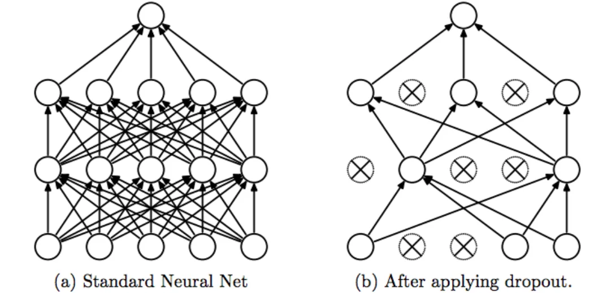
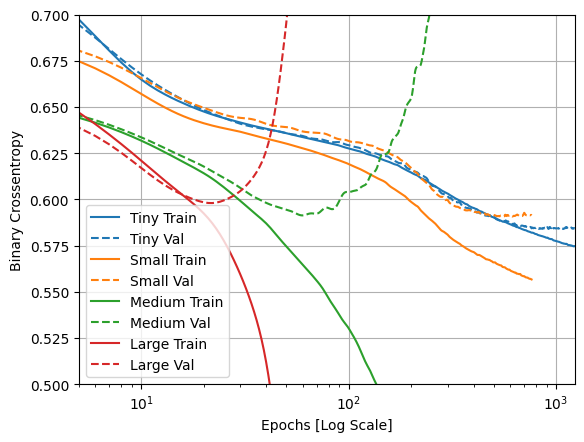

# Dataloader
[Keras Datasets Colab Notebook](https://colab.research.google.com/drive/1VjnExycQkn68joEgQnSFY0gOsmnHIi24?usp=sharing)

# Overfitting - Underfitting
[Keras Colab Notebook](https://colab.research.google.com/drive/1kc1qhTYiTLJGv4NYmc0-yns-sXb91kY4?usp=sharing)

## How to prevent overfitting?

1. Increase the amount of data
2. Regularization (Weight decay)
3. Dropout
4. Early stopping: stop early, once the validation loss stops improving
5. Data augmentation
6. Simplify the model (reduce variance, increase bias)
7. Use ensemble methods: Ensemble methods involve training multiple models and combining their predictions`

## Dropout
Criple the neural network by randomly removing some neurons (set them to 0)

# Question:
Which of the following models below are overfitting?

# Tensorflow playground
http://playground.tensorflow.org/

[
    [
        [1, 2],
        [3, 4],
        [5, 6],
    ],
    [
        [1, 2],
        [3, 4],
        [5, 6],
    ],    
]

[1, 2, 3, 4, 5, 6, 1, 2, 3, 4, 5, 6]